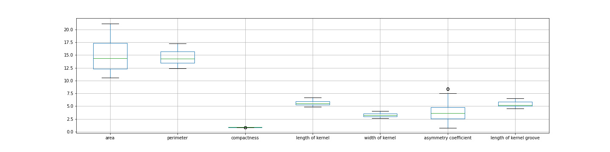
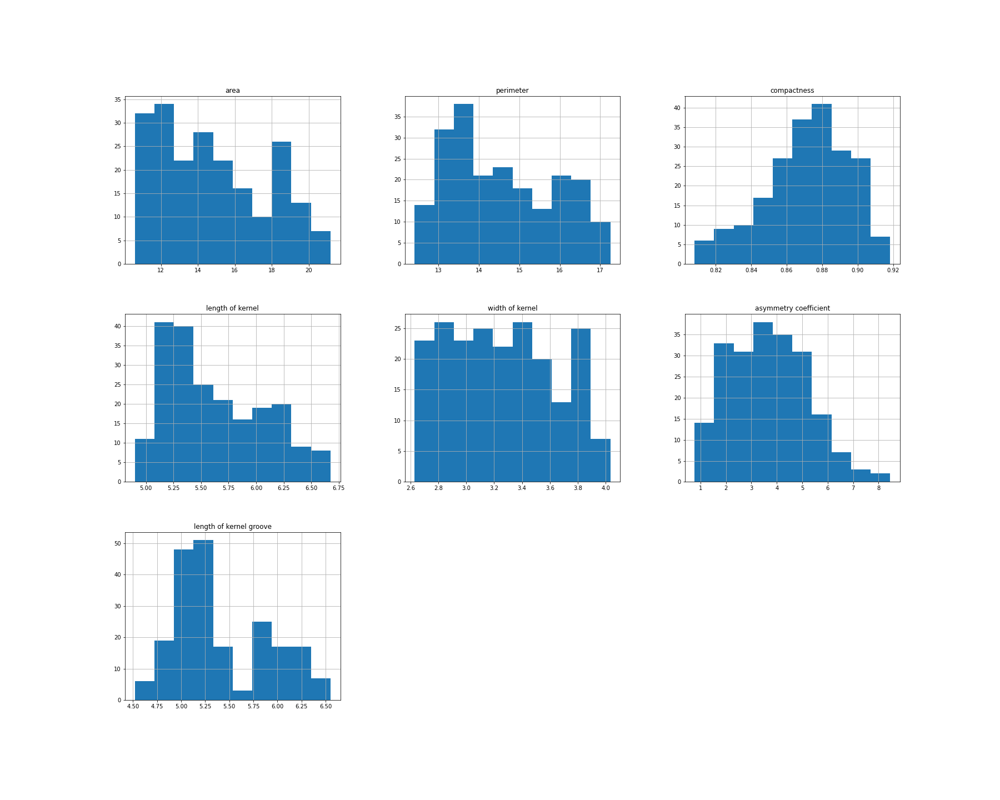

# Machine Learning Techniques to Predict Wheat Type from Kernel
The 'seeds' dataset provided is a csv file that contains information on different wheat kernels and the type of wheat they came from. The three types were: Kama, Rosa and Canadian. The independent variables used were area, perimeter, compactness, length of kernel, width of kernel, asymmetry coefficient and length of kernel groove. The dataset came from: https://archive.ics.uci.edu/dataset/236/seeds.

The aim of this project is to use three different machine learning methods; support vector machine, random forest and Knn to predict the wheat a kernel belongs to. The data will be prepared, preprocessed, trained and tested. Finally, a conclusion will be given.

All packages used:

```
import pandas as pd
import numpy as np
from sklearn.pipeline import Pipeline, make_pipeline
from sklearn.compose import ColumnTransformer
from sklearn.base import BaseEstimator, TransformerMixin
from sklearn.preprocessing import StandardScaler, RobustScaler, FunctionTransformer
from sklearn.model_selection import train_test_split, GridSearchCV
from sklearn import svm
from sklearn.ensemble import RandomForestClassifier
from sklearn.neighbors import KNeighborsClassifier
from sklearn.metrics import roc_curve, auc, accuracy_score, precision_recall_fscore_support
from sklearn import set_config
import pickle
import matplotlib.pyplot as plt
```

Import data and check for na values.

```
df = pd.read_csv("seeds.csv")
df.head()

df.isna().sum()
```
Check for outliers:

```
df.loc[:,'area':'length of kernel groove'].boxplot(figsize=(20,5))
plt.show()

df.loc[:,'area':'length of kernel groove'].hist(bins=10, figsize=(25, 20))
plt.show()
```
<div style="display: flex; justify-content: space-between;">
  
  
</div>


